Medical Insurance Prices - EDA
================
Marcin Górski
2026-01-15

## Wstępny ogląd danych

``` r
library(psych)
library(ggplot2)
library(tidyverse)

medins <- read.csv("D:/Studia/WdAD/EDA/medical-charges.csv")

head(medins, 3)
```

    ##   age    sex   bmi children smoker    region   charges
    ## 1  19 female 27.90        0    yes southwest 16884.924
    ## 2  18   male 33.77        1     no southeast  1725.552
    ## 3  28   male 33.00        3     no southeast  4449.462

``` r
tail(medins, 3)
```

    ##      age    sex   bmi children smoker    region   charges
    ## 1336  18 female 36.85        0     no southeast  1629.833
    ## 1337  21 female 25.80        0     no southwest  2007.945
    ## 1338  61 female 29.07        0    yes northwest 29141.360

``` r
str(medins)
```

    ## 'data.frame':    1338 obs. of  7 variables:
    ##  $ age     : int  19 18 28 33 32 31 46 37 37 60 ...
    ##  $ sex     : chr  "female" "male" "male" "male" ...
    ##  $ bmi     : num  27.9 33.8 33 22.7 28.9 ...
    ##  $ children: int  0 1 3 0 0 0 1 3 2 0 ...
    ##  $ smoker  : chr  "yes" "no" "no" "no" ...
    ##  $ region  : chr  "southwest" "southeast" "southeast" "northwest" ...
    ##  $ charges : num  16885 1726 4449 21984 3867 ...

``` r
medins$sex <- as.factor(medins$sex)

medins$smoker <- as.factor(medins$smoker)

medins$region <- as.factor(medins$region)

psych::describe(medins)
```

    ##          vars    n     mean       sd  median  trimmed     mad     min      max
    ## age         1 1338    39.21    14.05   39.00    39.01   17.79   18.00    64.00
    ## sex*        2 1338     1.51     0.50    2.00     1.51    0.00    1.00     2.00
    ## bmi         3 1338    30.66     6.10   30.40    30.50    6.20   15.96    53.13
    ## children    4 1338     1.09     1.21    1.00     0.94    1.48    0.00     5.00
    ## smoker*     5 1338     1.20     0.40    1.00     1.13    0.00    1.00     2.00
    ## region*     6 1338     2.52     1.10    3.00     2.52    1.48    1.00     4.00
    ## charges     7 1338 13270.42 12110.01 9382.03 11076.02 7440.81 1121.87 63770.43
    ##             range  skew kurtosis     se
    ## age         46.00  0.06    -1.25   0.38
    ## sex*         1.00 -0.02    -2.00   0.01
    ## bmi         37.17  0.28    -0.06   0.17
    ## children     5.00  0.94     0.19   0.03
    ## smoker*      1.00  1.46     0.14   0.01
    ## region*      3.00 -0.04    -1.33   0.03
    ## charges  62648.55  1.51     1.59 331.07

Zestaw składa się z 7 kolumn i pokazuje ceny ubezpieczeń dla konkretnych
osób. Do danych o tych indywiduach należą: wiek, BMI, liczba dzieci
(**dane numeryczne**), oraz płeć, czy są palące i region (na potrzeby
projektu traktowane jako **kategoryczne**). W analizie skupię się na
tym, czy i w jakim stopniu zmienne opisujące osoby ubezpieczane wpływają
na wysokość płaconych przez nich składek.

## Braki danych

``` r
library(mice)

md.pattern(medins)
```

    ##  /\     /\
    ## {  `---'  }
    ## {  O   O  }
    ## ==>  V <==  No need for mice. This data set is completely observed.
    ##  \  \|/  /
    ##   `-----'

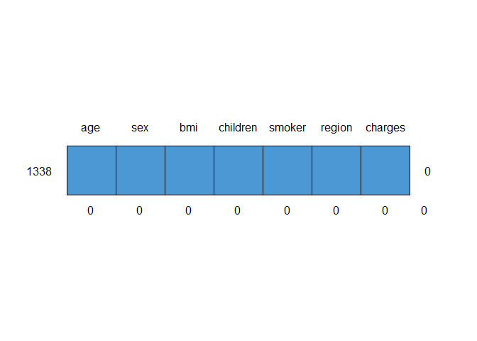<!-- -->

    ##      age sex bmi children smoker region charges  
    ## 1338   1   1   1        1      1      1       1 0
    ##        0   0   0        0      0      0       0 0

Autor zestawu danych nie kłamał - nie mamy żadnych braków.

## Analiza zmiennych, wartości odstające

``` r
library(gridExtra) #do ustawienia wykresow obok siebie

#kategoryczne

wykresy_kat <- list() ##lista na wykresy

wykresy_kat$plec <- medins %>%
  ggplot() +
  geom_bar(aes(x=sex),
           color = "darkblue", fill="lightblue") +
  theme_bw(base_size=14) +
  labs(title="Płeć")


wykresy_kat$palacze <- medins %>%
  ggplot() +
  geom_bar(aes(x=smoker),
           color = "darkblue", fill="lightblue") +
  theme_bw(base_size=14) +
  labs(title="Palący")

wykresy_kat$region <- medins %>%
  ggplot() +
  geom_bar(aes(x=region),
           color = "darkblue", fill="lightblue") +
  theme_bw(base_size=14) +
  theme(axis.text.x = element_text(angle = 45, hjust = 1)) +
  labs(title="Region")

#ilosciowe
wykresy_ilosciowe <- list() #lista na wykresy

wykresy_ilosciowe$wiek <- medins %>%
  ggplot() +
  geom_histogram(aes(x = age), 
                 bins = 10,
                 color = "darkgreen", fill = "lightgreen") +
  theme_light(base_size = 14) +
  labs(title = "Wiek")


wykresy_ilosciowe$wiek_box <- medins %>%
  ggplot() +
  geom_boxplot(aes(x = age),
                 color = "darkgreen", fill = "lightgreen") +
  theme_light(base_size = 14) +
  labs(title = "Wiek")

wykresy_ilosciowe$bmi <- medins %>%
  ggplot() +
  geom_histogram(aes(x = bmi), 
                 bins = 10,
                 color = "darkgreen", fill = "lightgreen") +
  theme_light(base_size = 14) +
  labs(title = "BMI")

wykresy_ilosciowe$bmi_box <- medins %>%
  ggplot() +
  geom_boxplot(aes(x = bmi),
                 color = "darkgreen", fill = "lightgreen") +
  theme_light(base_size = 14) +
  labs(title = "BMI")

wykresy_ilosciowe$dzieci <- medins %>%
  ggplot() +
  geom_bar(aes(x=children),
           color = "darkgreen", fill="lightgreen") +
  theme_bw(base_size=14) +
  labs(title="Liczba dzieci")


wykresy_ilosciowe$dzieci_box <- medins %>%
  ggplot() +
  geom_boxplot(aes(x = children),
                 color = "darkgreen", fill = "lightgreen") +
  theme_light(base_size = 14) +
  labs(title = "Liczba dzieci")

wykresy_ilosciowe$oplaty <- medins %>%
  ggplot() +
  geom_histogram(aes(x = charges), 
                 bins = 10,
                 color = "darkgreen", fill = "lightgreen") +
  theme_light(base_size = 14) +
  theme(axis.text.x = element_text(angle = 45, hjust = 1)) +
  labs(title = "Opłaty")

wykresy_ilosciowe$oplaty_box <- medins %>%
  ggplot() +
  geom_boxplot(aes(x = charges),
                 color = "darkgreen", fill = "lightgreen") +
  theme_light(base_size = 14) +
  theme(axis.text.x = element_text(angle = 45, hjust = 1)) +
  labs(title = "Opłaty")

#wyswietlanie wykresow:

grid.arrange(
  wykresy_kat$plec,
  wykresy_kat$palacze,
  wykresy_kat$region,
  nrow=1,
  ncol=3
)
```

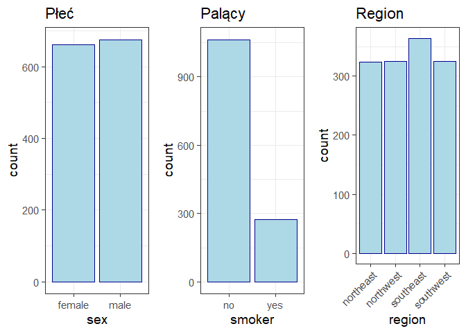<!-- -->

``` r
table(medins[,c("sex", "smoker")])
```

    ##         smoker
    ## sex       no yes
    ##   female 547 115
    ##   male   517 159

Płeć i regiony mają w przybliżeniu równą ilość obserwacji. Osób palących
nasz zbiór zawiera zdecydowanie mniej niż niepalących, ale wciąż nie są
to przypadki jednostkowe. Przy okazji zauważamy, że nieco większy jest
odsetek palących mężczyzn (23.52%), niż kobiet (17.37%). Czy istotnie?
Do tego wrócę na dalszym etapie.

``` r
grid.arrange(
  wykresy_ilosciowe$wiek,
  wykresy_ilosciowe$wiek_box,
  wykresy_ilosciowe$bmi,
  wykresy_ilosciowe$bmi_box,
  wykresy_ilosciowe$dzieci,
  wykresy_ilosciowe$dzieci_box,
  wykresy_ilosciowe$oplaty,
  wykresy_ilosciowe$oplaty_box,
  nrow=2,
  ncol=4
)
```

<!-- -->

``` r
cat("Wiek:")
```

    ## Wiek:

``` r
quantile(medins$age, 
         probs = c(0, 0.01, 0.25, 0.5, 0.75, 0.95, 0.99, 1))
```

    ##   0%   1%  25%  50%  75%  95%  99% 100% 
    ##   18   18   27   39   51   62   64   64

``` r
cat("BMI:")
```

    ## BMI:

``` r
quantile(medins$bmi, 
         probs = c(0, 0.01, 0.25, 0.5, 0.75, 0.95, 0.99, 1))
```

    ##       0%       1%      25%      50%      75%      95%      99%     100% 
    ## 15.96000 17.89515 26.29625 30.40000 34.69375 41.10600 46.40790 53.13000

``` r
cat("Dzieci:")
```

    ## Dzieci:

``` r
quantile(medins$children, 
         probs = c(0, 0.01, 0.25, 0.5, 0.75, 0.95, 0.99, 1))
```

    ##   0%   1%  25%  50%  75%  95%  99% 100% 
    ##    0    0    0    1    2    3    5    5

``` r
cat("Opłaty:")
```

    ## Opłaty:

``` r
quantile(medins$charges, 
         probs = c(0, 0.01, 0.25, 0.5, 0.75, 0.95, 0.99, 1))
```

    ##        0%        1%       25%       50%       75%       95%       99%      100% 
    ##  1121.874  1252.973  4740.287  9382.033 16639.913 41181.828 48537.481 63770.428

Struktura wieku jest w przybliżeniu jednostajna, a wartości odstające
nie występują. Histogram BMI przypomina rozkład normalny, a wykres
pudełkowy wskazuje na nieliczne wartości odstające z prawej strony,
natomiast osób przekraczających poziom 41 jest ledwo 5%.Rozkład
dzietności jest silnie skośny - jedynie 5% osób ma więcej dzieci niż 3,
a wartość maksymalna to 5. Na koniec opłaty - tutaj histogram również
jest prawostronnie skośny, a wykres pudełkowy ujawnia wartości
odstające. Jedynie 1% próby płaci powyżej 48,5 tysiąca, a wartość
maksymalna to aż blisko 64 tysiące.

``` r
library(corrplot)

medins$smoker_num <- as.numeric(medins$smoker) 

cor = cor(medins[,c("age", "bmi", "children", "smoker_num", "charges")], 
          method = "spearman")

corrplot(cor, method = "square", type = "upper")
```

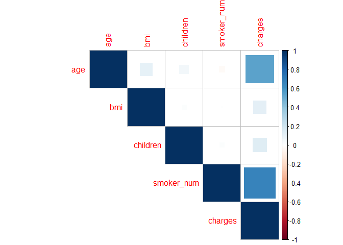<!-- -->

Macierz korelacji ujawnia **wyraźny związek wieku oraz palenia i
wysokości opłat**. Powiązania między pozostałymi zmiennymi ilościowymi
są znacznie wątlejsze, natomiast nie widać, żeby jakiekolwiek zmienne
były skorelowane ujemnie.

# Szukanie zależności

## BMI

W celu zbadania istnienia zależności między masą ciała a innymi
zmiennymi, do zestawu dołączam nową kolumnę “bmi_category”, przyjmującą
wartości Low (dla osób z niedowagą, czyli BMI \< 18.5), Normal, oraz
High (dla otyłych, BMI \> 30).

``` r
#dodajemy nowa kolumne kategoryzujaca wg BMI

medins$bmi_category <- factor(ifelse(medins$bmi<18.5, "Low", ifelse(medins$bmi<=30, "Normal", "High")), levels = c("Low", "Normal", "High"))

wykresy_bmi <- list()

wykresy_bmi$dzieci <- medins %>%
  ggplot() +
  geom_bar(aes(x = factor(children), fill = bmi_category),
           color = "white", 
           position = "fill") +
  theme_light() +
  labs(title = "Liczba dzieci a kategoria BMI",
       x = "liczba dzieci",
       y = "liczba obserwacji",
       fill = "BMI")

wykresy_bmi$plec <- medins %>%
  ggplot() +
  geom_bar(aes(x = factor(sex), fill = bmi_category),
           color = "white", 
           position = "fill") +
  theme_light() +
  labs(title = "Płeć a kategoria BMI",
       x = "płeć",
       y = "liczba obserwacji",
       fill = "BMI")

wykresy_bmi$palacze <- medins %>%
  ggplot() +
  geom_bar(aes(x = factor(smoker), fill = bmi_category),
           color = "white", 
           position = "fill") +
  theme_light() +
  labs(title = "Osoby palące a kategoria BMI",
       x = "czy paląca",
       y = "liczba obserwacji",
       fill = "BMI")

wykresy_bmi$region <- medins %>%
  ggplot() +
  geom_bar(aes(x = factor(region), fill = bmi_category),
           color = "white", 
           position = "fill") +
  theme_light() +
  theme(axis.text.x = element_text(angle = 45, hjust = 1)) +
  labs(title = "Region a kategoria BMI",
       x = "region",
       y = "liczba obserwacji",
       fill = "BMI")

grid.arrange(
  wykresy_bmi$plec,
  wykresy_bmi$palacze,
  wykresy_bmi$region,
  wykresy_bmi$dzieci,
  nrow=2,
  ncol=2
)
```

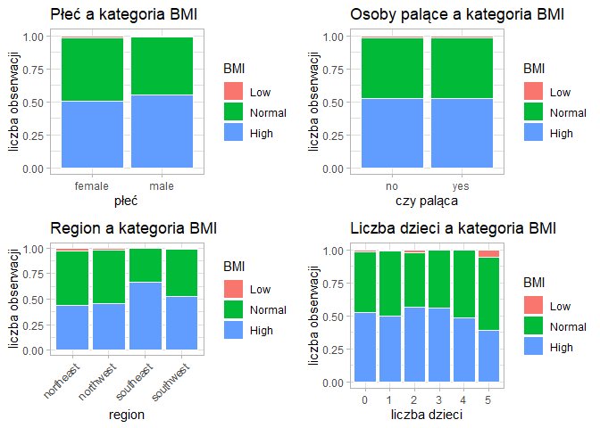<!-- -->

Jedyna zmienna kategoryczna, która na oko zdaje się być znacząca
względem BMI, to region. Czy faktycznie osoby z południowego zachodu są
“bardziej odżywione”? Chcę przeprowadzić **jednoczynnikową analizę
wariancji**. Oczywiście najpierw sprawdzamy założenia:

``` r
library(nortest)

medins %>%
  filter(region=="northeast") %>%
  pull(bmi) %>%
  lillie.test()
```

    ## 
    ##  Lilliefors (Kolmogorov-Smirnov) normality test
    ## 
    ## data:  .
    ## D = 0.036625, p-value = 0.3618

``` r
medins %>%
  filter(region=="northwest") %>%
  pull(bmi) %>%
  lillie.test()
```

    ## 
    ##  Lilliefors (Kolmogorov-Smirnov) normality test
    ## 
    ## data:  .
    ## D = 0.026358, p-value = 0.8426

``` r
medins %>%
  filter(region=="southeast") %>%
  pull(bmi) %>%
  lillie.test()
```

    ## 
    ##  Lilliefors (Kolmogorov-Smirnov) normality test
    ## 
    ## data:  .
    ## D = 0.036843, p-value = 0.2679

``` r
medins %>%
  filter(region=="southwest") %>%
  pull(bmi) %>%
  lillie.test()
```

    ## 
    ##  Lilliefors (Kolmogorov-Smirnov) normality test
    ## 
    ## data:  .
    ## D = 0.029848, p-value = 0.6858

-Test Lillieforsa (ze względu na dużą liczbę danych rezygnuję z
Shapiro-Wilka) nie znajduje podstaw do odrzucenia hipotezy o normalności
rozkładu BMI w żadnym regionie. Przechodzę do drugiego z założeń:

``` r
test_bartlett <- bartlett.test(bmi~region, data=medins)
test_bartlett
```

    ## 
    ##  Bartlett test of homogeneity of variances
    ## 
    ## data:  bmi by region
    ## Bartlett's K-squared = 18.742, df = 3, p-value = 0.0003091

-Test Bartletta, sprawdzający równość wariancji w grupach. Niestety,
tutaj p-value wynosi zaledwie 3.0909252^{-4}, więc dostosowuję podejście
i korzystam z testu ANOVA Welcha:

``` r
oneway.test(bmi ~ region, data=medins)
```

    ## 
    ##  One-way analysis of means (not assuming equal variances)
    ## 
    ## data:  bmi and region
    ## F = 35.834, num df = 3.00, denom df = 739.54, p-value < 2.2e-16

Otrzymane p-value jest bardzo małe, więc przechodzę do analizy post-hoc,
a konkretnie do testu Gamesa-Howella:

``` r
library(PMCMRplus)

gamesHowellTest(bmi ~ region, data=na.omit(medins[, c("bmi", "region")]))
```

    ##           northeast northwest southeast
    ## northwest 0.9999    -         -        
    ## southeast < 2e-16   < 2e-16   -        
    ## southwest 0.0103    0.0059    2.3e-08

Potwierdza się teoria wysnuta na podstawie wykresu. Osoby z regionu
Southeast mają BMI inne, niż pozostałe regiony. Co więcej, Southwest
również istotnie różni się od terenów północnych. Kierunek zależności
możemy odczytać z poprzedniego wykresu - najwięcej osób otyłych
znajdziemy na południowym wschodzie, południowy zachód jest pomiędzy, a
w regionach północnych jest najwięcej osób o prawidłowym wskaźniku, a
większa jest również populacja osób z niedowagą.

## Osoby palące a płeć

Wrócę do pytania zadanego na początku - czy można stwierdzić, że więcej
mężczyzn, niż kobiet pali? Oczywiście wykonam test dwóch odsetków
(jednostronny). Danych z pewnością jest więcej niż wystarczająco, a
odsetki empiryczne (ok. 17 i 23%) są na granicy prawdopodobieństw
skrajnych.

``` r
wektor_palacy <- medins %>%
  count(sex, smoker) %>%
  filter(smoker=="yes") %>%
  pull()  

wektor_plcie <- medins %>%
  count(sex) %>%
  pull()

odsetek_palacych <- prop.test(x=wektor_palacy, n=wektor_plcie, alternative="less")
```

Test wykazał, że faktycznie odsetek palących mężczyzn jest istotnie
wyższy, niż kobiet (przy p-value = 0.0032741).

## Osoby palące a wiek

Czy oprócz płci, jest jeszcze inna zmienna, która wpływa na skłonność do
palenia? Sprawdźmy, czy zmienia się to z wiekiem.

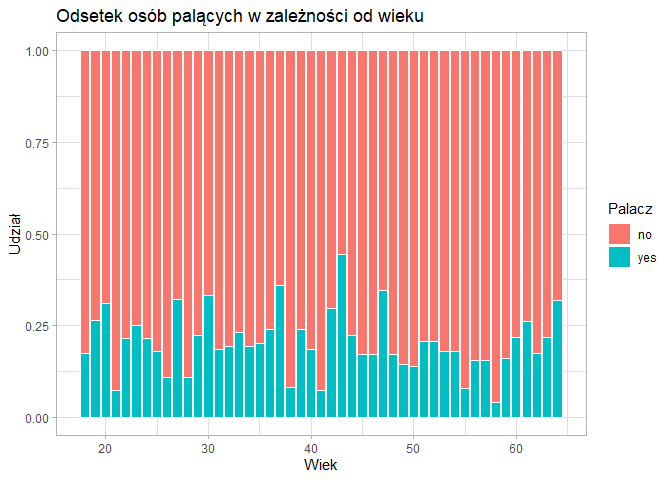<!-- -->

Macierz korelacji z pierwszego etapu nie wykazała żadnej zależności
między paleniem a wiekiem, a wykres (skumulowany 100%) zdaje się to
potwierdzać. Największy odsetek, bliski 50%, jest dla osób w wieku
średnim, natomiast ciężko dopatrzyć się tu jakiegokolwiek trendu.

# Osoby palące a BMI

Wcześniej patrzyliśmy już na wykres słupkowy BMI z podziałem na osoby
palące i niepalące, gdzie nie zauważyliśmy wyraźnej różnicy. Natomiast
może niezdrowe nawyki żywieniowe idą w parze ze skłonnością do palenia?
W tym celu “przebadamy” grupy z niskim i wysokim BMI.

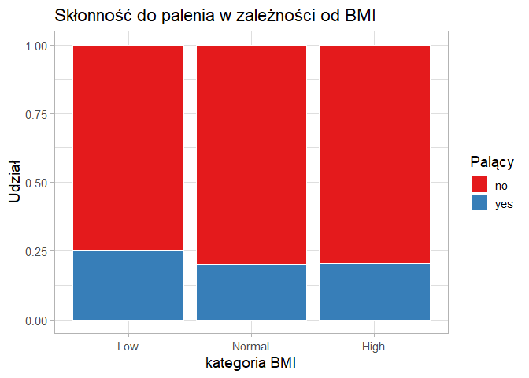<!-- --> Zdaje się, że
najwięcej palących znajduje się w grupie o niskim BMI, a najmniej -
wśród otyłych. Sprawdzę to, ponownie korzystając z testu dla dwóch
odsetków.

``` r
medins %>%
  filter(bmi_category=="Low") %>%
  count(smoker)
```

    ##   smoker  n
    ## 1     no 15
    ## 2    yes  5

``` r
medins %>%
  filter(bmi_category=="High") %>%
  count(smoker)
```

    ##   smoker   n
    ## 1     no 561
    ## 2    yes 144

Okazuje się, że osób kwalifikujących się do niskiego BMI jest ledwo 20.
To za mała liczba obserwaji do przeprowadzenia testu asymptotycznego.
Zamiast tego zbadam grupy Normal i High.

``` r
palacze_bmi <- medins %>%
  count(bmi_category, smoker) %>%
  filter(bmi_category %in% c("Normal", "High")) %>%
  filter(smoker == "yes") %>%
  pull()

lacznie_bmi <- medins %>%
  count(bmi_category) %>%
  filter(bmi_category %in% c("Normal", "High")) %>%
  pull()

odsetek_palacych <- prop.test(x=palacze_bmi, n=lacznie_bmi, alternative="greater")

odsetek_palacych
```

    ## 
    ##  2-sample test for equality of proportions with continuity correction
    ## 
    ## data:  palacze_bmi out of lacznie_bmi
    ## X-squared = 8.7473e-30, df = 1, p-value = 0.5
    ## alternative hypothesis: greater
    ## 95 percent confidence interval:
    ##  -0.03728946  1.00000000
    ## sample estimates:
    ##    prop 1    prop 2 
    ## 0.2039152 0.2042553

Odsetki palących różnią się w tych grupach o ledwo 1 punkt procentowy,
nie dziwi więc rezultat testu i otrzymane p-value: 0.5.

## Osoby palące a liczba dzieci

Na koniec tej części sprawdzę, czy istnieje zależność między liczbą
potomstwa a skłonnością do palenia. Najpierw spójrzmy na wizualizację:

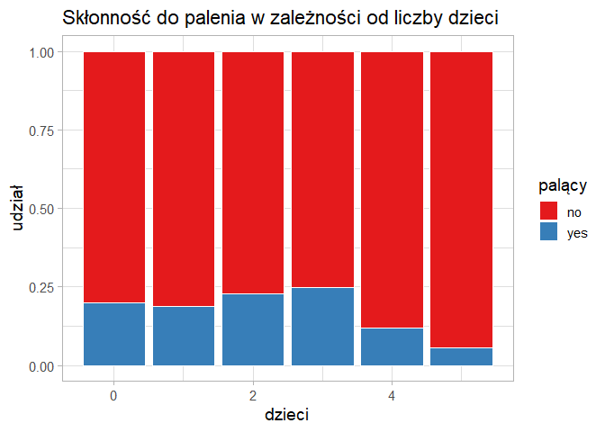<!-- -->

Najmniejszy odsetek palących widzimy dla osób z 4 lub 5 dziećmi, ale
pamiętamy, że takich danych w zestawie mamy niewiele. W każdym razie
wykres nie daje nadziei na znalezienie zależności między tymi zmiennymi.

# Co wpływa na wysokość płaconych składek?

Przejdę do głównego tematu analizy. Najpierw zajmę się jedną ze
zmiennych, na której istotność wskazuje macierz korelacji - wiekiem.

## Wiek a opłaty

``` r
medins %>%
  ggplot() +
  geom_point(aes(x = age, y = charges), size = 2, 
             color = "grey50", alpha = 0.2) +
  theme_light(base_size = 14) +
  labs(title = "Związek między wiekiem a wysokością opłat",
       x = "wiek",
       y = "opłaty")
```

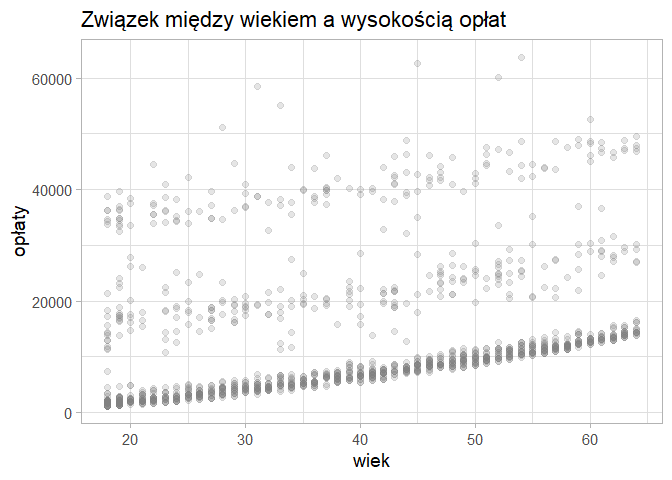<!-- -->

Wykres wskazuje na wręcz liniową zależność, widoczną na dole wykresu,
natomiast dla każdego wieku jest spora grupa osób płacących znacznie
większe składki, niż większośc rówieśników. Te odstające punkty również
układają się we dwie, już nieco mniej wyraźne linie. Podejrzewam, że po
części odpowiada za to podział na palących i niepalących.

## Wiek i palenie a opłaty

``` r
medins %>%
  ggplot() +
  geom_point(aes(x = age, y = charges, color = smoker),
             size = 2.5) + 
    scale_fill_brewer(palette="Set1") +
  theme_light(base_size = 14) +
  labs(title = "Związek między wiekiem a wysokością opłat",
       x = "wiek",
       y = "opłaty")
```

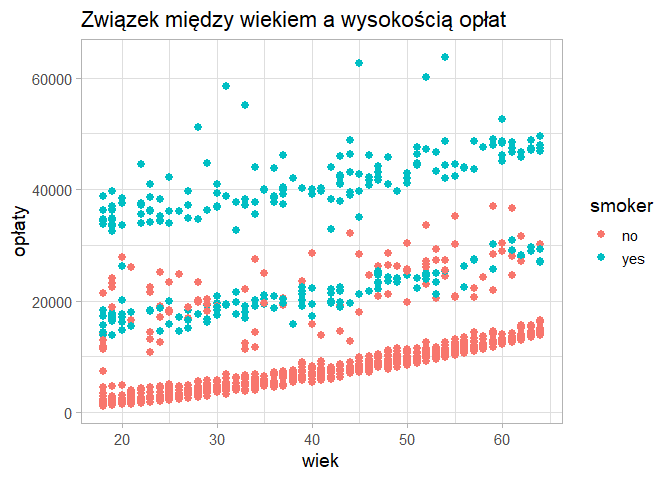<!-- -->
Teoria się potwierdziła. Dolny segment składa się wyłącznie z osób
niepalących, a górny z palących. Środkowy ma po trochu obu tych grup.
Czy jest jeszcze jakaś zmienna, która w prosty sposób wyjaśni istnienie
tej środkowej grupy? Spróbujmy z BMI.

## Wiek, palenie i BMI a opłaty

``` r
medins %>%
  ggplot() +
  geom_point(aes(x = age, y = charges, color = smoker),
             size = 2.5) + 
    scale_fill_brewer(palette="Set1") +
  facet_wrap(~bmi_category, ncol=3) +
  theme_light(base_size = 14) +
  labs(title = "Związek między wiekiem a wysokością opłat",
       x = "wiek",
       y = "opłaty")
```

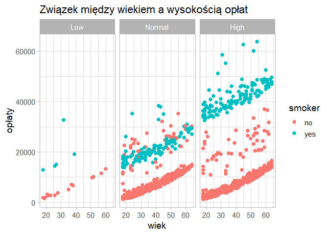<!-- -->

Podział wykresów ze względu na BMI rzuca trochę więcej światła na
temat - palacze mają znacznie większą szanse trafić do “środkowej”
grupy, jeśli ich masa ciała jest prawidłowa. U otyłych wszyscy palacze
płacą najwięcej, a grupy dolna i środkowa są zajęte przez niepalących.
By sprawdzić, czy “kary” za palenie i jednocześnie bycie otyłym się
zwielokrotniają, chcę przeprowadzić ANOVĘ, tym razem dwuczynnikową.
Najpierw założenia:

``` r
library(car)

medins %>%
  group_by(smoker, bmi_category) %>%
  count()
```

    ## # A tibble: 6 × 3
    ## # Groups:   smoker, bmi_category [6]
    ##   smoker bmi_category     n
    ##   <fct>  <fct>        <int>
    ## 1 no     Low             15
    ## 2 no     Normal         488
    ## 3 no     High           561
    ## 4 yes    Low              5
    ## 5 yes    Normal         125
    ## 6 yes    High           144

``` r
tapply(medins$charges[medins$bmi_category == "Low"], 
       medins$smoker[medins$bmi_category == "Low"], 
       lillie.test)
```

    ## $no
    ## 
    ##  Lilliefors (Kolmogorov-Smirnov) normality test
    ## 
    ## data:  X[[i]]
    ## D = 0.21128, p-value = 0.07028
    ## 
    ## 
    ## $yes
    ## 
    ##  Lilliefors (Kolmogorov-Smirnov) normality test
    ## 
    ## data:  X[[i]]
    ## D = 0.2895, p-value = 0.1822

``` r
leveneTest(charges ~ smoker * bmi_category, data = medins)
```

    ## Levene's Test for Homogeneity of Variance (center = median)
    ##         Df F value Pr(>F)
    ## group    5  1.2314 0.2919
    ##       1332

Niestety, założenia nie są spełnione - Lilliefors wskazuje na brak
normalności, nie wszystkie grupy (BMI - Low) są wystarczająco liczne, by
skorzystać z CTG, a do tego test Levene’a (zamiast Bartletta, bo ten
jest wrażliwy na brak normalności, który już stwierdziliśmy) pokazuje
heteroskedastyczność.

Na koniec postaram się w inny sposób zbadać wpływ tych zmiennych, a
tymczasem zostały nam jeszcze 3 zmienne, których wpływu nie
sprawdziliśmy. Teraz zobaczmy, czy dzieci “kosztują”.

## Dzieci a opłaty

``` r
medins %>%
  ggplot() +
  geom_boxplot(aes(x = as.factor(children), y = charges),
                 color = "darkgreen", fill = "lightgreen") +
  theme_light(base_size = 14) +
  labs(title = "Opłaty w zależności od liczby dzieci")
```

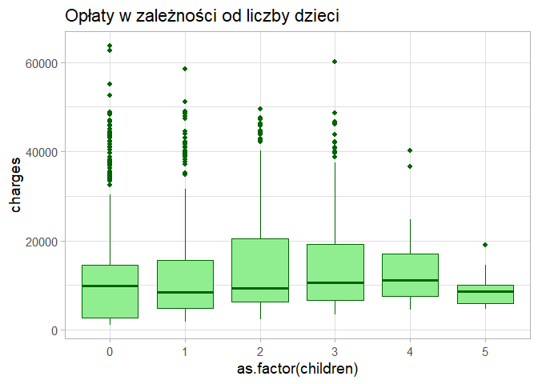<!-- -->

Mediany wszystkich pudełek są do siebie zbliżone, ale te z większą
ilością dzieci są “zawieszone” nieco wyżej. Zaskakuje niskie położenie
pudełka odpowiadającego piątce dzieci, ale tylko dopóki nie sprawdzimy,
że takich danych w zbiorze jest jedynie 18, więc wnioski mogą być
niemiarodajne (tak jak przy skłonności do palenia).

## Region a opłaty

Analogicznie postępuję dla regionu:

``` r
medins %>%
  ggplot() +
  geom_boxplot(aes(x = region, y = charges),
                 color = "darkgreen", fill = "lightgreen") +
  theme_light(base_size = 14) +
  labs(title = "Opłaty w zależności od regionu")
```

<!-- -->

Najwyżej sięga pudełko “southeast”, ale pamiętam, że to właśnie tam
najwięcej jest osób otyłych. W związku z tym to pewnie nie sam region, a
właśnie masa ciała osób z tego obszaru wydłuża pudełko.

## Płeć a opłaty

Pozostaje sprawdzenie, czy opłaty różnią się w zależności od płci.

``` r
medins %>%
  ggplot() +
  geom_boxplot(aes(x = sex, y = charges),
                 color = "darkgreen", fill = "lightgreen") +
  theme_light(base_size = 14) +
  labs(title = "Opłaty w zależności od płci")
```

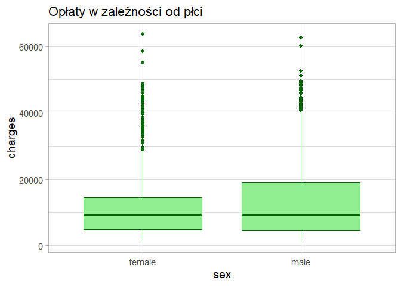<!-- -->

Mediany są tu niemal identyczne, różni się rozkład wartości skrajnych.
Nie jest to zaskakujące, biorąc pod uwagę, że już ustaliliśmy, że więcej
mężczyzn jest palaczami. Dla pewności sprawdzimy to odpowiednim testem
statystycznym.

``` r
medins %>%
  filter(sex=="female") %>%
  pull(charges) %>%
  lillie.test()
```

    ## 
    ##  Lilliefors (Kolmogorov-Smirnov) normality test
    ## 
    ## data:  .
    ## D = 0.1843, p-value < 2.2e-16

``` r
medins %>%
  filter(sex=="male") %>%
  pull(charges) %>%
  lillie.test()
```

    ## 
    ##  Lilliefors (Kolmogorov-Smirnov) normality test
    ## 
    ## data:  .
    ## D = 0.19806, p-value < 2.2e-16

Test Lillieforsa odrzuca hipotezę o normalności rozkładu opłat dla obu
płci. Stosujemy test nieparametryczny - Wilcoxona.

``` r
wilcox.test(charges ~ sex, data=medins)
```

    ## 
    ##  Wilcoxon rank sum test with continuity correction
    ## 
    ## data:  charges by sex
    ## W = 221304, p-value = 0.7287
    ## alternative hypothesis: true location shift is not equal to 0

Test nie znalazł podstaw do odrzucenia hipotezy o różnicy w średnich
opłatach.

# Modele

Na zakończenie postaram się tak podzielić zbiór na grupy, by można było
na nich zbudować jak najdokładniejsze modele liniowe. Na pewno z
poprzednich wykresów wiemy, że największe składki płacą osoby z wysokim
BMI i jednocześnie palące - to nasza pierwsza grupa. Podejmę się jeszcze
próby znalezienia dodatkowego czynnika, skutkującego przynależnością do
środkowej grupy.

``` r
medins%>%
  filter(bmi_category %in% c("Low",  "Normal") | (bmi_category=="High" & smoker=="no")) %>%
  ggplot() +
  geom_point(aes(x = age, y = charges, color = as.factor(children)),
             size = 2.5) + 
  facet_wrap(~bmi_category, ncol=3) +
  theme_light(base_size = 14) +
  labs(title = "Związek między wiekiem a wysokością opłat",
       x = "wiek",
       y = "opłaty",
       color = "dzieci")
```

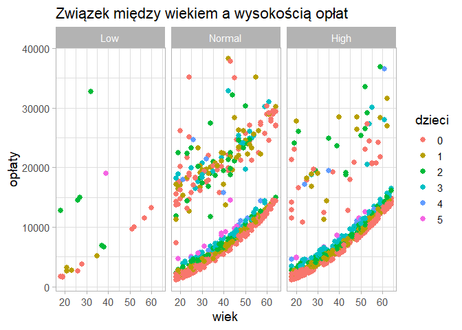<!-- --> Przed
wygenerowaniem wykresu “odsiałem” od zbioru otyłych palaczy. Niestety,
żadna pozostała zmienna (płeć, region i widoczne powyżej dzieci) nie są
powodem trafiania do środkowej części. Może tak naprawdę za wszystko
odpowiada BMI, po prostu nie uwzględniłem nadwagi? Dodam teraz tę
czwartą grupę (nadwaga to nowe High, a otyli to Very High).

``` r
medins$bmi_category <- factor(ifelse(medins$bmi<18.5, "Low", ifelse(medins$bmi<=25, "Normal", ifelse(medins$bmi<=30, "High", "Very High"))), levels = c("Low", "Normal", "High", "Very High"))

medins %>%
  ggplot() +
  geom_point(aes(x = age, y = charges, color = smoker),
             size = 2.5) + 
    scale_fill_brewer(palette="Set1") +
  facet_wrap(~bmi_category, ncol=3) +
  theme_light(base_size = 14) +
  labs(title = "Związek między wiekiem a wysokością opłat",
       x = "wiek",
       y = "opłaty")
```

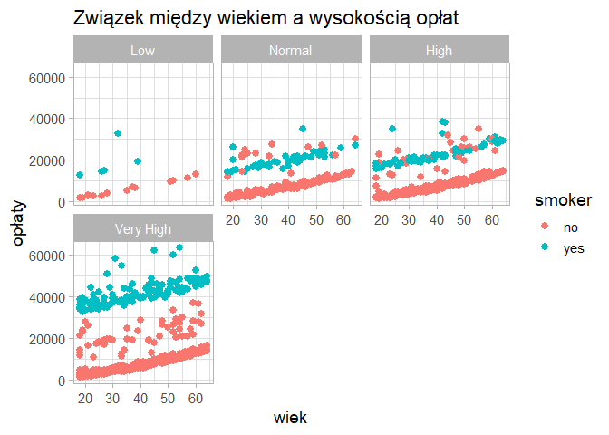<!-- -->

Wykresy Normal i High wyglądają prawie identycznie. Podział na tylko 3
kategorie nie był w tym wypadku błędem. Dochodzę do wniosku, że środkowa
grupa, swoją drogą najbardziej rozrzucona, jest spowodowana innymi
czynnikami, których ten zbiór nie zawiera. Wracam do 3 kategorii BMI i
dzielę zbiór wg tych zależności, których udało mi się doszukać.

``` r
medins$bmi_category <- factor(ifelse(medins$bmi<18.5, "Low", ifelse(medins$bmi<=30, "Normal", "High")), levels = c("Low", "Normal", "High"))

grupa1 <- medins%>%
  filter(bmi_category=="High" & smoker=="yes")

grupa2 <- medins %>%
  filter(bmi_category!="High" & smoker=="yes")

grupa3 <- medins %>%
  filter(smoker=="no")
```

## Osoby otyłe, palące:

``` r
grupa1 %>%
  ggplot() +
  geom_point(aes(x = age, y = charges), size = 2, 
             color = "grey50") +
  theme_light() +
  labs(title = "Wiek a opłaty w grupie 1",
       x = "wiek",
       y = "opłaty")
```

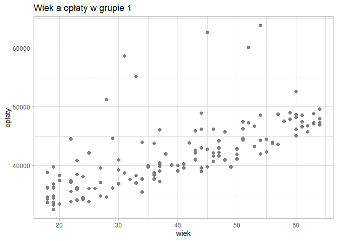<!-- --> Trend jest
niemalże idealny, poza sześcioma wartościami odstającymi. Przyjrzę się
im, żeby zobaczyć, czy coś je charakteryzuje.

``` r
grupa1 %>%
  filter(charges > 50000 & age < 55) %>%
  arrange(age)
```

    ##   age    sex    bmi children smoker    region  charges smoker_num bmi_category
    ## 1  28   male 36.400        1    yes southwest 51194.56          2         High
    ## 2  31 female 38.095        1    yes northeast 58571.07          2         High
    ## 3  33 female 35.530        0    yes northwest 55135.40          2         High
    ## 4  45   male 30.360        0    yes southeast 62592.87          2         High
    ## 5  52   male 34.485        3    yes northwest 60021.40          2         High
    ## 6  54 female 47.410        0    yes southeast 63770.43          2         High

``` r
mean(grupa1$bmi)
```

    ## [1] 35.54476

Moje podejrzenie o tym, że są to osoby z wyjątkowo wysokim BMI, się nie
sprawdza. Tylko jeden przypadek znacząco odbiega od średniej. Są to
przypadki, które z powodów nieznanych zestawowi danych płacą znacznie
wyższe składki, więc budując model dla ogółu otyłych palaczy, pominę je.

``` r
grupa1 <- grupa1 %>%
  filter(charges < 50000 | age > 55)
  
model_gr1 <- lm(charges ~ age, data=grupa1)

summary(model_gr1)
```

    ## 
    ## Call:
    ## lm(formula = charges ~ age, data = grupa1)
    ## 
    ## Residuals:
    ##     Min      1Q  Median      3Q     Max 
    ## -4072.9 -1653.1  -545.4  1319.3  8257.0 
    ## 
    ## Coefficients:
    ##             Estimate Std. Error t value Pr(>|t|)    
    ## (Intercept) 30157.44     579.83   52.01   <2e-16 ***
    ## age           276.68      13.93   19.87   <2e-16 ***
    ## ---
    ## Signif. codes:  0 '***' 0.001 '**' 0.01 '*' 0.05 '.' 0.1 ' ' 1
    ## 
    ## Residual standard error: 2365 on 136 degrees of freedom
    ## Multiple R-squared:  0.7437, Adjusted R-squared:  0.7418 
    ## F-statistic: 394.7 on 1 and 136 DF,  p-value: < 2.2e-16

``` r
grupa1 %>%
  ggplot(aes(x = age, y = charges)) +
  geom_point(size = 2, 
             color = "grey50") +
  geom_smooth(method="lm", color="red", formula=y~x) +
  theme_light() +
  labs(title = "Wiek a opłaty w grupie 1",
       x = "wiek",
       y = "opłaty")
```

<!-- -->

``` r
reszty <- residuals(model_gr1)

shapiro.test(reszty)
```

    ## 
    ##  Shapiro-Wilk normality test
    ## 
    ## data:  reszty
    ## W = 0.94362, p-value = 2.206e-05

``` r
qqnorm(reszty)
```

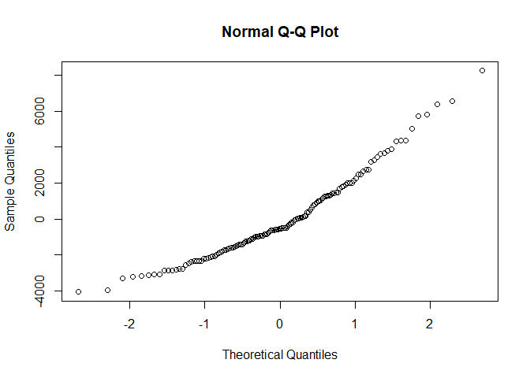<!-- -->

``` r
hist(reszty)
```

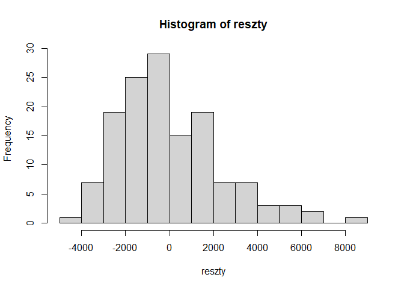<!-- -->

Naturalnie model doszedł do wniosku, że wiek ma istotny wpływ na koszty.
Tylko przy użyciu tej jednej zmiennej wyjaśnia 74.37% zmienności opłat w
tej grupie. Mimo to, reszty modelu nie są normalne. Na histogramie widać
dłuższy ogon po prawej stronie, co świadczy o tym, że model ma tendencję
do zaniżania opłat. Nie nadaje się do wyznaczania kosztów dla konkretnej
osoby, ale dobrze wizualizuje trend.

## Pozostałe osoby palące

Osoby palące na wykresach dla BMI Low i Normal prawie zawsze trafiają do
środkowej części, dlatego to będzie nasza druga grupa.

``` r
grupa2 %>%
  ggplot() +
  geom_point(aes(x = age, y = charges), size = 2, 
             color = "grey50") +
  theme_light() +
  labs(title = "Wiek a opłaty w grupie 1",
       x = "wiek",
       y = "opłaty")
```

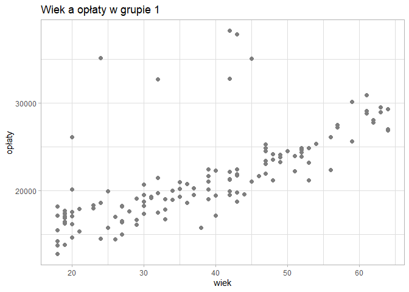<!-- -->

Sytuacja wygląda tu niemal identycznie co w poprzedniej grupie (tym
razem naliczyłem 7 outlierów), więc powtórzę wszystkie kroki.

``` r
grupa2 %>%
  filter((charges > 25000 & age < 40 | charges>30000 & age < 55)) %>%
  arrange(age)
```

    ##   age    sex    bmi children smoker    region  charges smoker_num bmi_category
    ## 1  20 female 24.420        0    yes southeast 26125.67          2       Normal
    ## 2  24   male 28.500        0    yes northeast 35147.53          2       Normal
    ## 3  32 female 17.765        2    yes northwest 32734.19          2          Low
    ## 4  42   male 26.070        1    yes southeast 38245.59          2       Normal
    ## 5  42   male 28.310        3    yes northwest 32787.46          2       Normal
    ## 6  43   male 27.800        0    yes southwest 37829.72          2       Normal
    ## 7  45   male 22.895        0    yes northeast 35069.37          2       Normal

``` r
mean(grupa2$bmi)
```

    ## [1] 25.35131

Ponownie historia się powtarza - outlierzy nie mają żadnych cech
wspólnych, uzasadniających wyższe koszty.

``` r
grupa2 <- grupa2 %>%
  filter(charges < 25000 | (charges<30000 & age > 40) | age > 55) 
  
model_gr2 <- lm(charges ~ age, data=grupa2)

summary(model_gr2)
```

    ## 
    ## Call:
    ## lm(formula = charges ~ age, data = grupa2)
    ## 
    ## Residuals:
    ##     Min      1Q  Median      3Q     Max 
    ## -4830.2 -1131.4   179.6  1142.2  4387.4 
    ## 
    ## Coefficients:
    ##             Estimate Std. Error t value Pr(>|t|)    
    ## (Intercept) 10367.74     454.60   22.81   <2e-16 ***
    ## age           270.61      11.27   24.02   <2e-16 ***
    ## ---
    ## Signif. codes:  0 '***' 0.001 '**' 0.01 '*' 0.05 '.' 0.1 ' ' 1
    ## 
    ## Residual standard error: 1696 on 121 degrees of freedom
    ## Multiple R-squared:  0.8266, Adjusted R-squared:  0.8252 
    ## F-statistic:   577 on 1 and 121 DF,  p-value: < 2.2e-16

``` r
grupa2 %>%
  ggplot(aes(x = age, y = charges)) +
  geom_point(size = 2, 
             color = "grey50") +
  geom_smooth(method="lm", color="red", formula=y~x) +
  theme_light() +
  labs(title = "Wiek a opłaty w grupie 2",
       x = "wiek",
       y = "opłaty")
```

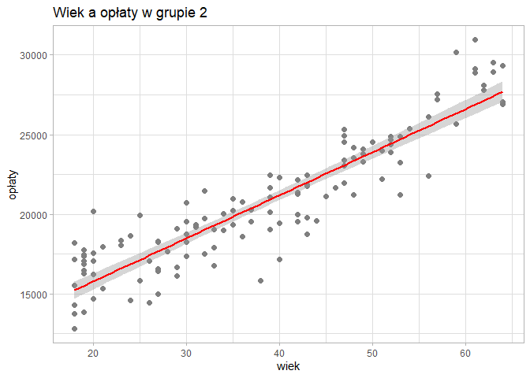<!-- -->

``` r
reszty2 <- residuals(model_gr2)

shapiro.test(reszty2)
```

    ## 
    ##  Shapiro-Wilk normality test
    ## 
    ## data:  reszty2
    ## W = 0.99387, p-value = 0.8725

``` r
qqnorm(reszty2)
```

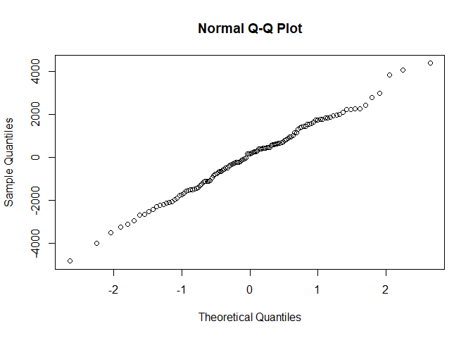<!-- -->

``` r
hist(reszty2)
```

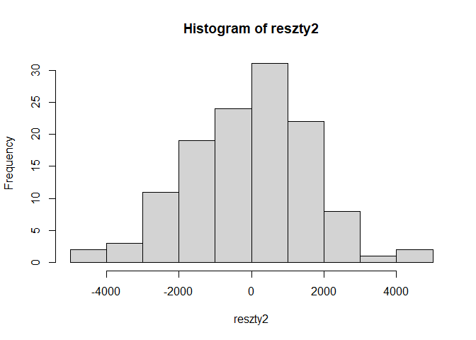<!-- -->

Model drugi sprawdza się nawet lepiej niż pierwszy - wyjaśnia 82.66%
zmienności, a Shapiro-Wilk ocenia jego reszty na normalne. Gdybyśmy byli
w stanie stwierdzić, że osoba nie będzie należeć do grupy outlierów,
których usunęliśmy przed zbudowaniem modelu, moglibyśmy używać go do
predykcji wysokości jej opłat.

## Osoby niepalące

Na koniec trzecia grupa, czyli wszyscy niepalący.

``` r
grupa3 %>%
  ggplot() +
  geom_point(aes(x = age, y = charges), size = 2, 
             color = "grey50") +
  theme_light() +
  labs(title = "Wiek a opłaty w grupie 3",
       x = "wiek",
       y = "opłaty")
```

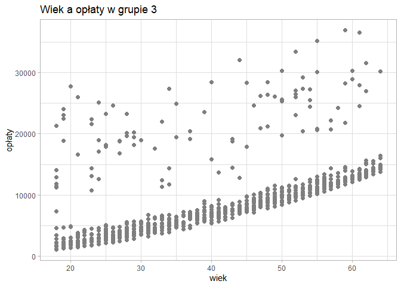<!-- -->

Na wykresie dla grupy 3 gołym okiem widzimy bardzo wyraźną zależność.
Większość osób niepalących jest zebrana na samym dole wykresu, na nieco
wypukłej krzywej. Ich regularne zagęszczenie może być spowodowane tym,
że ubezpieczyciel uwzględnia wiek z dokładnoscią do miesiąca, a zmienna
“wiek” w naszym zestawie jest dyskretna. Co do punktów niewpisujących
się w ten trend, podejrzewam, że są to osoby, którym ubezpieczyciel z
różnych powodów przypisał wyższy poziom ryzyka, a ich składki mogły być
wycenione indywidualnie.

# Wnioski końcowe

Przeprowadzona eksploracyjna analiza danych nie pozostawia wątpliwości
co do najważniejszych zmiennych determinujących wysokość płaconych
składek - są to **wiek, palenie i bycie otyłym**. Dane są w większości
zgrupowane wokół trzech krzywych, a analiza wszystkich zmiennych
zawartych w zestawie nie pozwoliła wskazać żadnej uzasadniającej
płacenie opłat pomiędzy tymi grupami. Zbiór danych nie zawiera
informacji takich, jak choroby przewlekłe czy historia medyczna danej
osoby oraz jego rodziny, a z całą pewnością ubezpieczyciele biorą te
rzeczy pod uwagę, wyceniając polisę. Co więcej, generują one praktycznie
nieskończoną ilość kombinacji, w zależności od ryzyka, jakie ze sobą
niosą, co uzasadnia brak jakiegokolwiek trendu dla punktów pomiędzy
wyraźnymi krzywymi, przedstawiającymi osoby bez tych dodatkowych
komplikacji.
